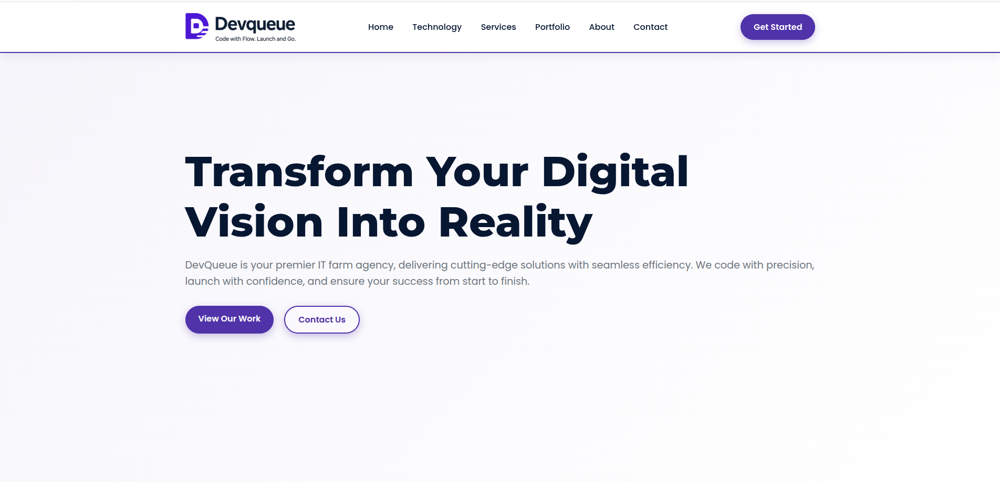
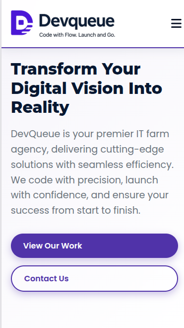

# DevQueue - IT Farm Agency Website

This is a responsive landing page for DevQueue, a premier IT farm agency. The website is designed to showcase the company's services, portfolio, and expertise in a modern and professional manner.

## Features

- **Responsive Design:** Fully responsive layout that works on all devices, from mobile phones to desktop computers.
- **Smooth Scrolling:** Smooth scrolling for anchor links for a better user experience.
- **Animations:** Subtle on-scroll animations to make the content more engaging.
- **Contact Form:** A functional contact form that allows users to get in touch with the company.
- **Modern UI/UX:** Clean and modern design with a focus on user experience.

## Technologies Used

- **HTML5:** For the structure of the website.
- **CSS3:** For styling the website, including Flexbox and Grid for layout.
- **JavaScript:** For interactive features like smooth scrolling and animations.
- **Font Awesome:** For icons used throughout the website.
- **Google Fonts:** For custom fonts.

## Getting Started

To get a local copy up and running follow these simple example steps.

### Prerequisites

You need a web browser to view the website.

### Installation

1. Clone the repo
   ```sh
   git clone https://github.com/mahadi-init/devqueue.git
   ```
2. Open `index.html` in your browser.

## Screenshots

| Desktop | Mobile |
| --- | --- |
|  |  |

## Contact

Your Name - [@your_twitter](https://twitter.com/your_twitter) - email@example.com

Project Link: [https://github.com/mahadi-init/devqueue](https://github.com/mahadi-init/devqueue)

## License

Distributed under the MIT License. See `LICENSE` for more information.
